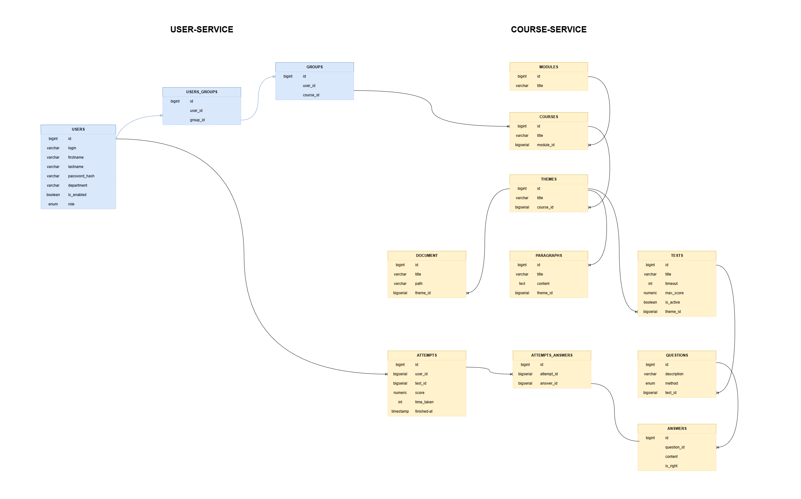

# Learning Management System

## Overview
**Learning management system (LMS)** is an application for the administration, tracking users' progress and publishing educational materials, training programs or development documents.



### Structure
Project is designed considering microservices architecture with api-gateway as an entry point to maintain extensibility.

+ **User-Service:** Responsible for user operations, authentication, registration and group management.
+ **Course-Service:** Manages materials operations.
+ **Front-end:** UI-client
+ **API-Gateway:** Manages routing for incoming requests to microservices.
+ **PostgreSQL:** Database used by services to store data.

### Stack
+ **Spring-Boot:** framework for building microservices.
+ **Liquibase:** library to track, manage, and apply database migrations
+ **Minio:** object management system used as file storage
+ **React:** front-end JavaScript library for building user interfaces (UI)
+ **Docker:** Services containerization.

## Installation
1. Clone the Repository
```
git clone https://github.com/vvsllvv/LStudy.git
```
2. Build and Run the Services
```
docker-compose up --build
```
3. Access the Services
   + **Front-end:** http://localhost:3000
   + **API-Gateway:** http://localhost:8080
   + **User-Service:** http://localhost:8081
   + **Course-Service:** http://localhost:8082

