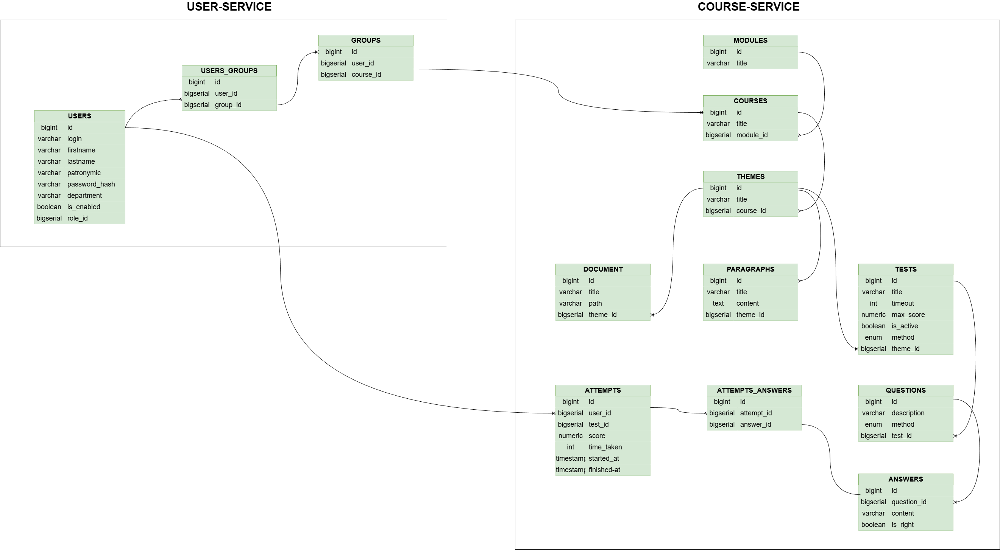
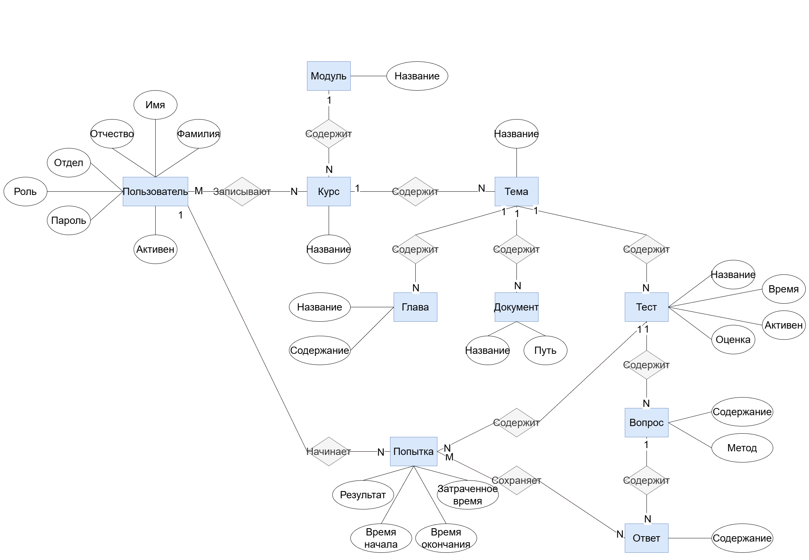
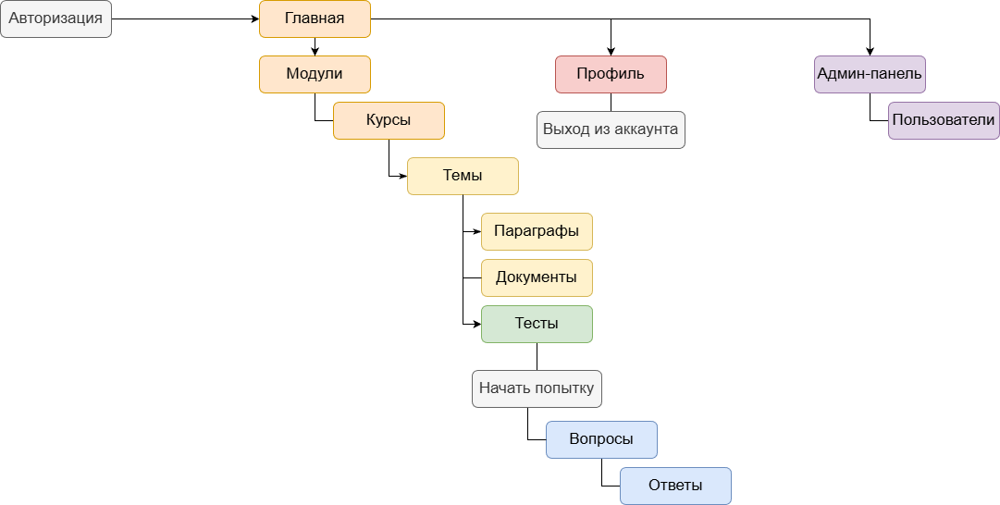

# Проектная работа

## Содержание
Системы управления обучением отвечают за сопровождение процесса обучения: повторное использование материалов, тестирование и управление пользователями.

### схема базы данных

### er-диаграмма

### карта сайта

